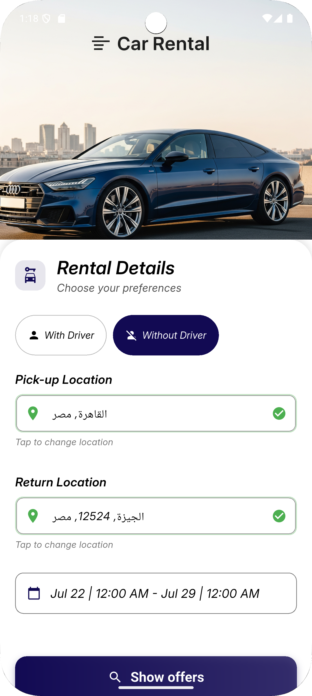
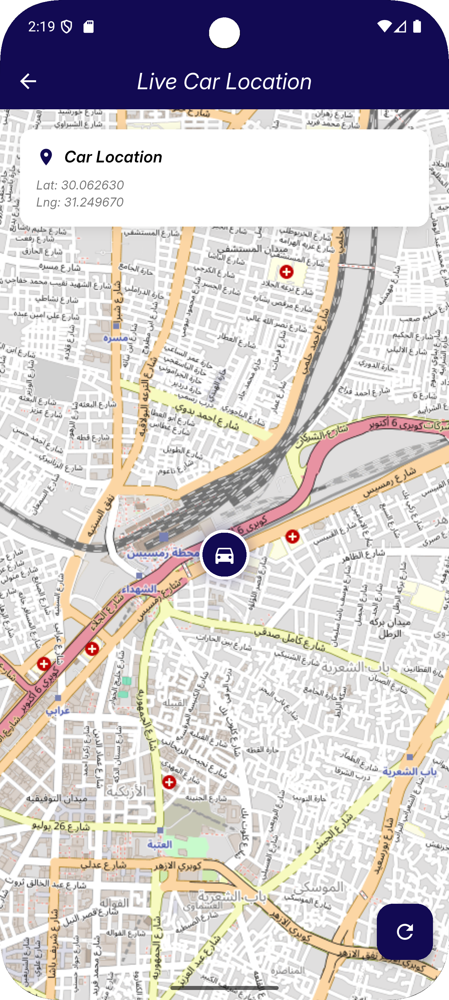
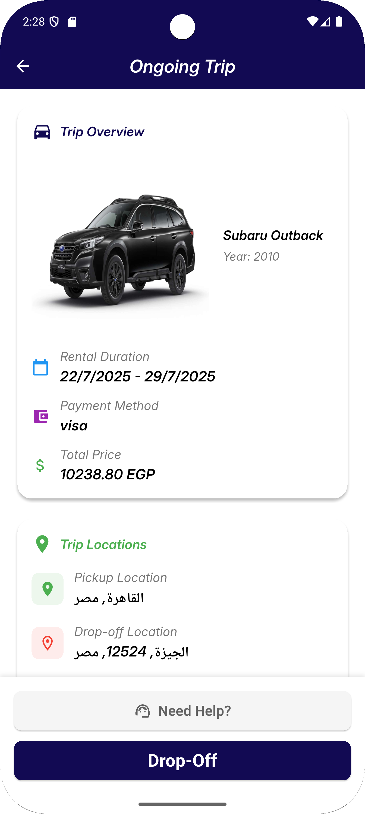
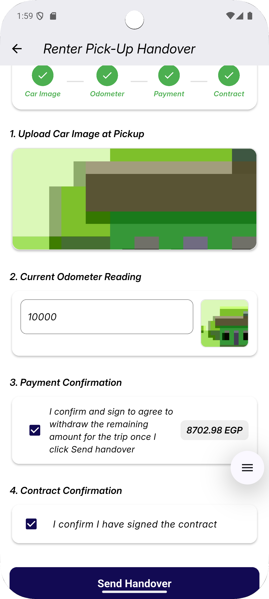

## 🏎️ **Cark – Smart Car Rental Platform (Graduation Project)**  

**Tech Stack:** Django REST Framework · Flutter · Flask (AI & ML) · MySQL · Microsoft Azure · Google Maps API · Paymob · Cloudflare  

An **AI-powered peer-to-peer car rental platform** that connects car owners with renters through a **secure and intelligent booking system**.  
The platform features **automated car matching**, **AI-driven vehicle and ID verification**, **real-time GPS tracking**, and **dynamic smart pricing** to optimize availability and demand.  
Built as a **scalable full-stack solution** using **Flutter** (frontend) and **Django REST Framework** (backend), with **Flask microservices** handling computer vision and identity validation.  
Deployed on **Microsoft Azure**, integrated with **Cloudflare tunneling** for **secure, high-performance, and cloud-optimized access**.  

🔗 **Repository:** [Cark – Smart Car Rental Platform](https://github.com/seifeldein1/Cark-Smart-Car-Rental-Platform)  

---

### 📱 **User Interface Previews**

#### 🔐 Authentication Flow
| Login | Registration |
|:--:|:--:|
|  |  |

#### 🚗 **Car Booking & Details**
| View Car Details | Request to Book | Rental Details |
|:--:|:--:|:--:|
|  |  |  |

#### 👤 **Owner Dashboard & Actions**
| Accept/Reject | Live Location | Handover (Pickup) |
|:--:|:--:|:--:|
|  |  |  |

| Owner Ongoing Trip | Drop-Off 1 | Drop-Off 2 |
|:--:|:--:|:--:|
|  |  |  |

| Drop-Off 3 & Feedback | Final Confirmation |
|:--:|:--:|
|  |  |

#### 🚙 **Renter Flow**
| Ongoing Trip | Pickup Handover | Drop-Off Handover |
|:--:|:--:|:--:|
|  |  |  |

| Drop-Off 2 | Drop-Off 3 & Feedback | Deposit Payment |
|:--:|:--:|:--:|
|  |  |  |

#### 🔔 **Notifications**

---

### 🧠 **Key Highlights**
- **AI-Based Verification:** Used Flask microservices and ResNet50 for car and ID recognition.  
- **Smart Pricing:** Dynamic pricing algorithm based on distance, demand, and car type.  
- **Real-Time Tracking:** Integrated Google Maps for live car location and route updates.  
- **Secure Payments:** Seamless integration with **Paymob** for deposits and billing.  
- **Cloud Deployment:** Hosted on **Microsoft Azure** with **Cloudflare** tunnels for security and uptime.  
